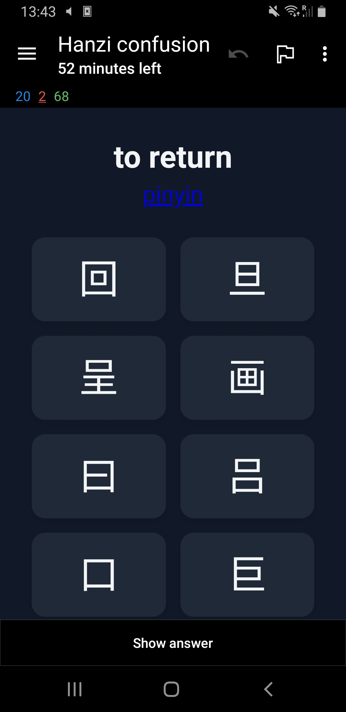
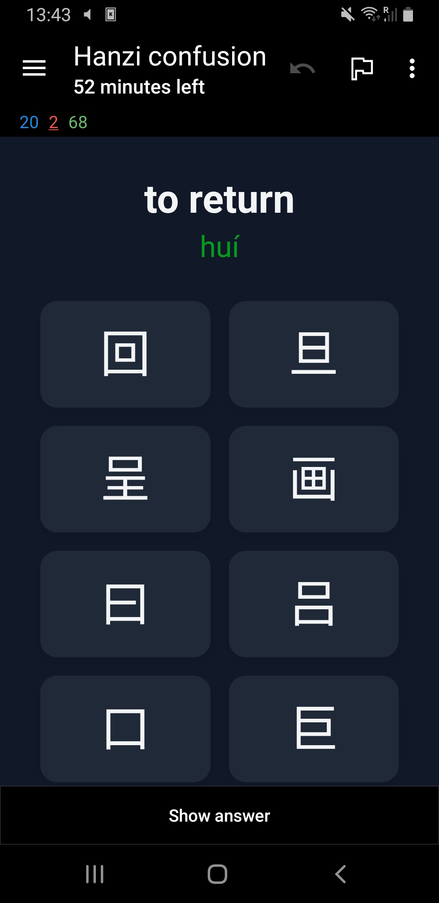
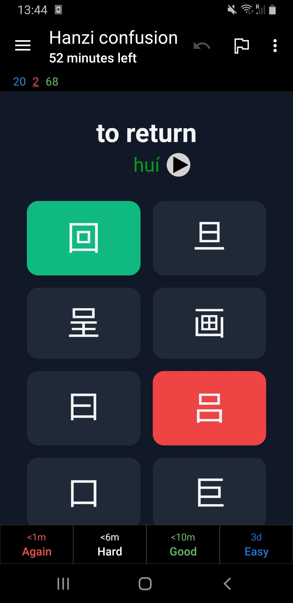
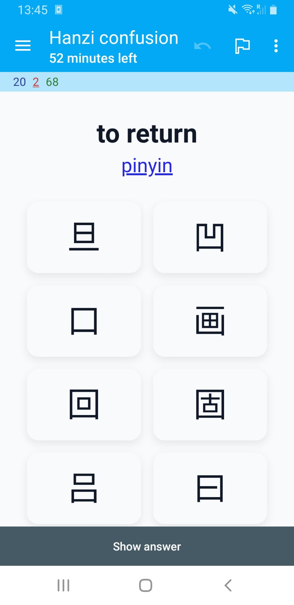
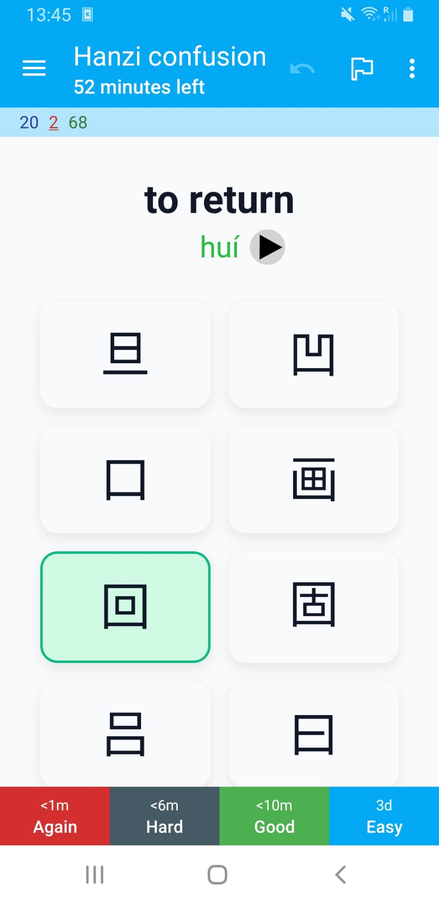
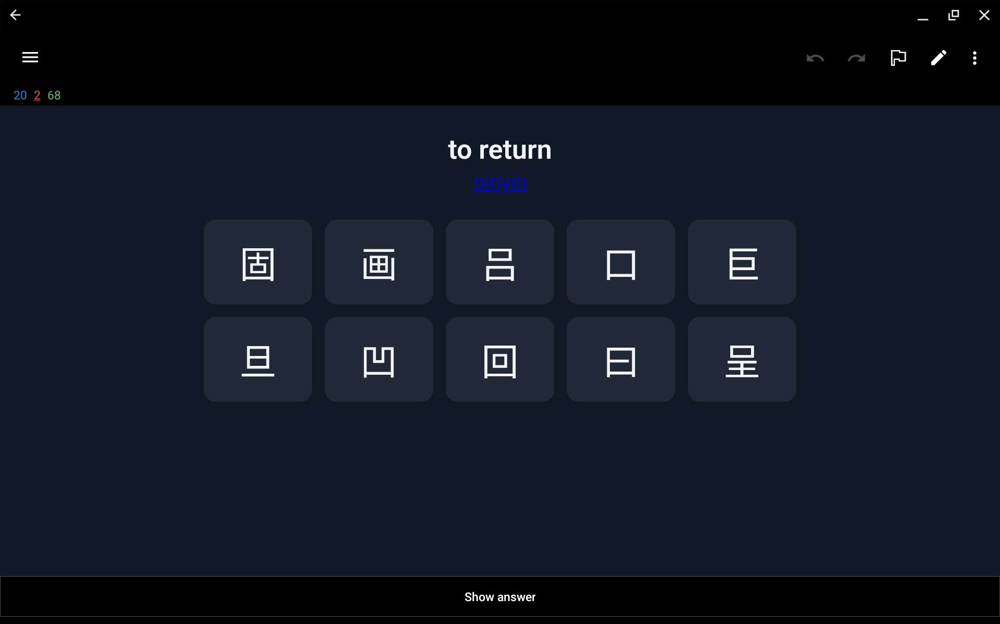

I'm currently in Beijing for a month studying Mandarin at a language school. Before coming to China I did a course at the Confucius Institute in the Netherlands. I passed the first [HSK exam](https://en.wikipedia.org/wiki/Hanyu_Shuiping_Kaoshi) only a few months ago, so I'm definitely still a beginner.

What makes the Chinese language difficult are the tonal system and the logographic script. Unlike alphabets, _hanzi_ requires memorizing thousands of unique symbols. 

Currently I know a couple of hundred characters which I practice daily using flashcards. Some I'm able to memorize after seeing them once or twice, but there are quite a few that are trickier to remember. 

I noticed that I often get confused when characters look very similar to each other. For example, the characters "矢" (shǐ, which means "dart") and "失" (shī, which means "to lose") look (and sound) pretty similar. The same is true for the characters "牛" (niú, which means "cow") and "午" (wǔ, which means "noon"). There are many more characters like that.

I was looking for a way to practice discriminating between these visually similar characters. I realized I could use a pre-trained neural network to generate an embedding for each hanzi image. By calculating the cosine distance between these embeddings, I can mathematically quantify how similar two characters look. 

In this post I'll explain how I used this idea to create flashcards for the [Anki system](https://apps.ankiweb.net/) that focus specifically on these similar looking characters. Each flashcard shows the meaning in English and you'll have to select its corresponding _hanzi_ from a set of similar looking characters. If you want a hint you can get the [pinyin](https://en.wikipedia.org/wiki/Pinyin) of the character.

If you're also studying Chinese you might find these useful. I'll provide a link at the end to download the complete deck. 

## Including dependencies

We'll start by downloading some dependencies. I'll be using the VGG-16 pre-trained model to get the embeddings.


```{python}
from IPython.display import Image, display
from tqdm.notebook import tqdm
from tensorflow.keras.preprocessing.image import load_img, img_to_array
from tensorflow.keras.applications.vgg16 import VGG16, preprocess_input
from sklearn.metrics.pairwise import cosine_distances

import matplotlib.pyplot as plt
import matplotlib.font_manager as fm
import matplotlib.ft2font as ft
import pandas as pd
import numpy as np
import os
```

## Creating images for common Chinese characters

I compiled a list of characters with their _pinyin_ and meaning in English that you need to know for each of the HSK levels. This list contains each characters as a unicode character and we need to somehow convert these to images so we can extract the embeddings.

We'll use a specific font file ([Noto Sans CJK](https://fonts.google.com/noto/specimen/Noto+Sans+SC)) that is placed in the working directory. This font has all the _hanzi_ characters we need.

The following function uses matplotlib to turn a Chinese character into an image and saves it to disk.

```{python}
FONT_FILE = 'NotoSansSC-Regular.ttf'

if not os.path.exists(FONT_FILE):
    raise RuntimeError(
        f"Font file '{FONT_FILE}' not found. Please place the Noto Sans CJK font file in the working directory."
    )
FONT_PROPERTIES = fm.FontProperties(fname=FONT_FILE)

def save_hanzi_image(char='我', out_path='images/wo.png', img_size=(224, 224), fg='black', bg='white'):
    """Render a single Hanzi character to a square PNG using Matplotlib.

    - char: Hanzi character to render
    - out_path: output PNG path
    - img_size: (width, height) in pixels
    - fg/bg: foreground/background colors
    Returns: out_path
    """
    dpi = 100
    width_in, height_in = img_size[0] / dpi, img_size[1] / dpi
    fig = plt.figure(figsize=(width_in, height_in), dpi=dpi)
    fig.subplots_adjust(0, 0, 1, 1)
    ax = fig.add_axes([0, 0, 1, 1])
    ax.set_axis_off()
    fig.patch.set_facecolor(bg)
    ax.set_facecolor(bg)

    # Scale font to fit the square nicely
    fontsize = int(min(img_size) * 0.77)
    ax.text(0.5, 0.4, char, fontproperties=FONT_PROPERTIES, fontsize=fontsize,
            ha='center', va='center', color=fg)

    os.makedirs(os.path.dirname(out_path) or '.', exist_ok=True)
    fig.savefig(out_path, dpi=dpi, facecolor=bg)
    plt.close(fig)
    return out_path
```

Let's test the function by generating the image for the character "我".

```{python}
out_file = save_hanzi_image('我', out_path='images/我.png', img_size=(224, 224))
print(f"Saved 我 to {out_file} using {FONT_FILE}")
display(Image(filename=out_file))
```

Beautiful! 

Note that we create images that are 224 by 224 pixels. This is the size that the VGG-16 pre-trained model expects.

Next we read the `hanzi.csv` file into a pandas dataframe. This is the file that contains the list of characters, their pinyin, meaning in English, and HSK level. 

```{python}

# Load hanzi list
df = pd.read_csv("hanzi.csv", sep=";", header=None, names=["pinyin", "hanzi", "meaning", "level"])
```

Let's look at 5 random rows to see what we got.

```{python}
df.sample(5)
```

There are quite a few characters that need to be converted.

```{python}
df.shape[0]
```

We loop through each character in this dataframe and convert them to a PNG image that is saved to disk.

```{python}
chars = df["hanzi"].tolist()
```

Rendering all characers will take a while but we only need to do this once.

```{.python}
# Render all characters
for ch in tqdm(chars, desc="Rendering characters"):
    out_file = save_hanzi_image(ch, out_path=f"images/{ch}.png", img_size=(224, 224))
```

```{python}
#| echo: false
for ch in tqdm(chars, desc="Rendering characters"):
    pass
```

## Getting the embedding for each character image

I've used the term _embedding_ a few times already, but what is that exactly?

An embedding in machine learning is a dense, lower-dimensional numerical vector representation of complex, high-dimensional data (such as words or images) that captures semantic meaning and relationships.

The way we get such an embedding is by using a pre-trained neural network. A popular choice for images is [VGG-16](https://en.wikipedia.org/wiki/VGGNet).  

VGG-16 is a 16-layer neural network trained on [ImageNet](https://en.wikipedia.org/wiki/ImageNet) to recognize 1000 different object categories. To get an embedding using this model we 'cut off' the final dense layers. This way, the model, instead of giving us a final prediction (like "Golden Retriever"), stops early at the last convolutional block, providing us with a raw numerical summary of the visual features it detected. This raw numerical summary is the _embedding_ we're interested in.

The following code initialized that VGG-16 model and calculates the embeddings. Because this is also a lengthy operation we save the result to a pandas dataframe.

```{.python}
# Build an embedding model from VGG16
# include_top=False removes the classification head
# pooling='avg' gives a single vector per image
embedding_model = VGG16(weights="imagenet", include_top=False, pooling="avg")

def image_to_embedding(image_path):
    """Load an image and return its VGG16 embedding vector."""
    img = load_img(image_path, target_size=(224, 224))
    x = img_to_array(img)
    x = np.expand_dims(x, axis=0)
    x = preprocess_input(x)
    embedding = embedding_model.predict(x, verbose=0)
    return embedding[0]

labels = list(chars)
image_paths = [f"images/{ch}.png" for ch in chars]

# Compute embeddings
embeddings = np.vstack([
    image_to_embedding(p) for p in tqdm(image_paths, desc="Calculating embeddings")
])

# Store embeddings in a DataFrame (as lists for easy saving)
df_embeddings = pd.DataFrame({
    "hanzi": labels,
    "embedding": embeddings.tolist()
})

# Save to disk
df_embeddings.to_csv("hanzi_embeddings.csv", index=False)
```

```{python}
#| echo: false
for ch in tqdm(chars, desc="Calculating embeddings"):
    pass
```

Once saved, we can reload the embeddings.

```{python}
# Read embeddings back from CSV
df_embeddings = pd.read_csv("hanzi_embeddings.csv")

# Convert embedding strings back to numpy arrays
df_embeddings["embedding"] = df_embeddings["embedding"].apply(eval).apply(np.array)
```

## Quantifying the similarity between characters

Now that we have the embedding for each character we can use the cosine distance to calculate how visually similar two characters are. The cosine distance varies from 0 to 2. When two embedding vectors point in roughly the same direction, in other words, the corresponding characters look similar, their cosine distance is close to 0. A cosine distance of 2 means the vectors point in opposite directions and are thus expected to be visually dissimilar.

Let's get the embeddings and corresponding character from the dataframe we just loaded.

```{python}
embeddings = df_embeddings["embedding"].tolist()
labels = df_embeddings["hanzi"].tolist()
```

We can compute the pairwise cosine distances between all embeddings as follows.

```{python}
cosine_dist = cosine_distances(embeddings)
```

## Finding visually similar characters

For each character we find the 9 most similar characters (excluding itself).

```{python}
rows = []
for i in range(len(labels)):
    # Get distances for this character
    distances = cosine_dist[i]
    
    # Get sorted indices (ascending order)
    sorted_indices = np.argsort(distances)
    
    # Skip index 0 (which is the character itself with distance 0) and take next 9
    top_indices = sorted_indices[1:10]
    
    # Build row
    row = {'hanzi': labels[i]}
    for j, idx in enumerate(top_indices, 1):
        row[f'distractor_{j}'] = labels[idx]
        row[f'distance_{j}'] = distances[idx]
    
    rows.append(row)

# Create DataFrame
df_similar = pd.DataFrame(rows)
```

By inspecting the first ten rows we see that our method seems to work pretty well.

```{python}
df_similar.head(10).style
```

## Preparing the data for the Anki flashcards

Anki allows us to create a set of flashcards from a CSV file. We want each flashcard to show the pinyin, the meaning in English, and the options to choose from (the hanzi and its distractors). I also want the deck to have tags for each HSK level so I can limit my studies to the exam I'm working towards.

We can create the CSV we'll feed into Anki as follows:

```{python}
df_result = (df
    .merge(df_similar, on='hanzi', how='left')
    .drop(columns=[col for col in df_similar.columns if col.startswith('distance_')]))
df_result['level'] = df_result['level'].str.upper()
df_result = df_result[['hanzi', 'pinyin', 'meaning'] + 
                      [f'distractor_{i}' for i in range(1, 10)] + 
                      ['level']]
```

Let's have a peek at what this file will look like.

```{python}
df_result.head(10).style
```

It looks good so we'll save it to disk.

```{python}
df_result.to_csv("hanzi_confusion.csv", index=False)
```

## Creating a custom card design

I defined a custom card that shows the characters the user can choose from. By clicking _pinyin_ the user will get to see the romanization of the word in Mandarin. After the user selects an option the card automatically flips. If the wrong option is selected, this is shown in red with the correct hanzi shown in green.

::: {layout-ncol=3}





:::

Both dark and light mode are supported.

::: {layout-ncol=2}



:::

The card also supports landscape mode.



The pinyin is shown in red, green, blue, purple, or grey for first, second, third, fourth, or neutral tone respectively. I used the default colors from the popular [Pleco app](https://www.pleco.com/) that many learners of Chinese use. On supported platforms you can make Anki pronounce the words using TTS.

The card has fields for each of the columns in the CSV file that we can now import into Anki.

## Project links

You can find all files including the custom card in this GitHub repository:

<a target="_blank" href="https://github.com/afvanwoudenberg/hanzi-confusion"></a>

The complete deck can also be downloaded from [AnkiWeb](https://ankiweb.net/shared/info/834008404).

I hope this helps in your Chinese studies. 

加油!


